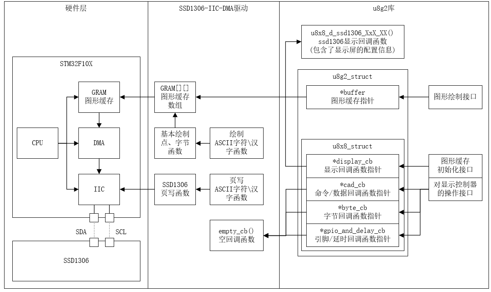

# STM32F1\_SSD1306\_IIC

STM32F1/StdPeriph_Lib 标准固件库/OLED/SSD1306 IIC/DMA方式/支持16x16 GBK汉字/移植u8g2

## 介绍

这是一个基于STM32F10x及其IIC接口和DMA控制器设计的SSD1306驱动的显示屏驱动代码，支持16x16 GBK汉字，并移植了u8g2第三方图形库，使用StdPeriph_Lib（标准固件库）编程。默认显示屏大小为128x64，并提供了测试样例。在默认的12864上，传输帧率可达43FPS，更小的屏幕意味着更少的数据量，传输帧率更高，实际帧率还会受渲染速度、刷新率等因素的影响。

注释和文档正在更新中

## 1. 快速上手 
### 1.1 克隆、硬件连接、编译
使用git命令下载本代码及子模块，u8g2的子模块c-periphery等可以不下载
```
git clone --recursive https://github.com/cnZhiran/STM32F1_SSD1306_IIC.git
```
如果你没有安装git，下载压缩包并解压。再点击 **[u8g2](https://github.com/olikraus/u8g2)** 下载压缩包，解压至u8g2\文件夹下。

本代码默认`PB6--SCL` `PB7--SDA` 。如果您使用杜邦线，请注意连接的可靠性
```
 _______________
/    stm32f1    \    ___________
|               |   /  SSD1306  \
|           PB6 |---| SCL       |
|           PB7 |---| SDA       |
|               |   \___________/
\_______________/
``` 
使用keil5打开项目文件，就可直接编译，注意ARM编译器版本为V5。

其他编辑环境正在更新，请移步第二章

### 1.2 常用API介绍
#### 初始化函数
`void OLED_Init(void)` 初始化

`void OLED_Display_On(void)` 打开屏幕

#### 页写入函数
`void OLED_ShowString(uint8_t page, uint8_t col, char *str)` 将字符串转化的字模，向SSD1306按照页写入

#### 显存绘制函数
`void OLED_DrawPoint(uint8_t x,uint8_t y,uint8_t mode)` 在显存中任意一个位置画一个点，可以点亮、熄灭、翻转

`void OLED_DrawString(uint8_t x, uint8_t y, char *str, uint8_t size, uint8_t mode)` 在显存中任意一个位置画字符串

#### 显存操作函数
`int OLED_Refresh_Gram(int sync);` 以DMA方式，向SSD1306更新一次缓存，`sync`控制是否等待更新结束

`int OLED_Continuous_Refresh_Start(void)` 开启DMA方式的连续显存更新

#### u8g2库支持函数
`u8g2_t *OLED_U8G2_Init(void);` u8g2库初始化，提供一个u8g2接口必需的u8g2_t型的结构体

#### 测试用例函数
`void OLED_Frame_Example(void)` 帧率测试用例，有4个不同帧率的数字向右移动，通过观察流畅度判断屏幕的实际帧率

`void OLED_Simulated_Noise_Example(void)` 模拟噪声用例，显示测量的传输帧率，并通过观察噪声分析CPU资源的利用率

`void OLED_CNZH_Example(void)` 中文测试用例，包含作者的母校名称和github名称

`void OLED_U8G2_Draw_Example(u8g2_t *u8g2)` u8g2的官方测试用例，检查u8g2库是否移植成功

`void OLED_Example_Loop(u8g2_t *u8g2)`或`void OLED_Example_Loop(void)` 混合测试用例，每隔5秒，顺序切换上述测试用例

## 2. 移植到您的项目
### 2.1 不移植u8g2库
### 2.2 移植u8g2库
### 2.3 u8g2库的其他功能
### 2.4 定制化编译选项
## 3. 编程资料
### 3.1 原理介绍

### 3.2 API介绍
## 4. 编程建议
### 4.1 抑制画面撕裂的方法